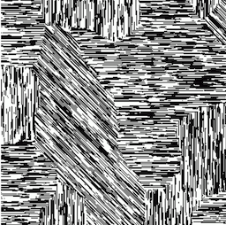
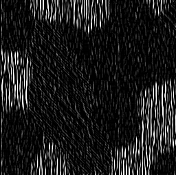
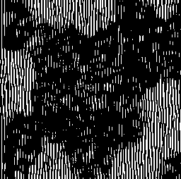
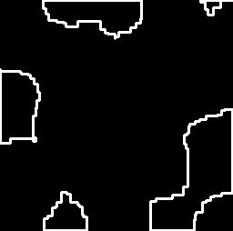
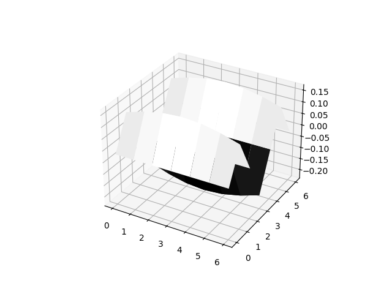

# Homework 04: Vertical Pattern Detection using Gabor Wavelets

**Course:** CSE 40535 Computer Vision
**University:** Notre Dame
**Due Date:** 02/18/2026

---

## Assignment Overview

This homework implements a computer vision pipeline to detect and segment regions with vertical stripe patterns using:
- Gabor wavelets for oriented pattern enhancement
- Otsu's method for automatic binarization
- Morphological operations for noise reduction and region consolidation

---

## Implementation Details

### Step 1: Gabor Kernel Configuration

**Selected Parameters:**
- `ksize = 7` - Kernel size (7×7 pixels)
- `sigma = 4.0` - Gaussian envelope width
- `theta = 0.0` - Vertical orientation (0° = vertical stripes)
- `lambda = 4.0` - Wavelength matching stripe spacing
- `gamma = 1.0` - Spatial aspect ratio (circular)
- `psi = 0.0` - Phase offset

**Rationale:**
- Moderate kernel size (7) provides good orientation selectivity without over-smoothing
- Sigma (4.0) gives broad spatial support relative to kernel size
- Lambda (4.0) tuned to match the stripe wavelength in the pattern
- Theta = 0.0 specifically targets vertical orientations

### Step 2: Image Filtering

Applied the Gabor filter using `cv2.filter2D()`. The filter responds strongly (bright) to vertical patterns and weakly (dark) to other orientations.

### Step 3: Otsu's Binarization

Used `cv2.threshold()` with `cv2.THRESH_OTSU` flag to automatically determine optimal threshold value. This maximizes inter-class variance (Fisher ratio) between foreground and background.

### Step 4: Morphological Operations

**Selected Operations:**
1. `cv2.MORPH_CLOSE` with 3×3 kernel (3 iterations)
   - Locally connects nearby white pixels from the binarization
2. `cv2.MORPH_OPEN` with 3×3 kernel (1 iteration)
   - Gently removes sparse noise pixels
3. `cv2.MORPH_CLOSE` with 9×9 kernel (2 iterations)
   - Solidifies detected regions into cohesive blocks
4. `cv2.MORPH_ERODE` with 3×3 kernel (3 iterations)
   - Tightens boundaries for more precise segmentation

**Rationale:**
- Small CLOSE first connects thin vertical line detections into wider regions
- Gentle OPEN removes isolated noise without destroying small valid blocks
- Larger CLOSE consolidates the connected regions into solid blocks
- Final ERODE shrinks the blocks back to more precise boundaries

---

## Results

### Input Pattern


The input contains rectangular regions with different stripe orientations:
- Vertical stripes (target regions to detect)
- Horizontal stripes (should be suppressed)
- Diagonal stripes (should be suppressed)

### Step 1: Gabor Filtering


Bright regions indicate strong response to vertical patterns. Darker regions show weaker response to non-vertical orientations.

### Step 2: Otsu's Binarization


Binary mask after automatic thresholding. White pixels represent detected vertical patterns.

### Step 3: Morphological Operations


Final segmentation after morphological cleanup. Consolidated regions mark areas with vertical stripe patterns.

### Step 4 (Bonus): Edge Detection


Contours extracted from the morphological mask using `cv2.findContours()`, drawn as white edges on a black background. This demarcates the boundaries of regions containing vertical stripe patterns.

### Gabor Kernel Visualization


3D visualization showing the Gabor kernel's sinusoidal oscillation pattern with Gaussian envelope.

---

## Key Concepts Demonstrated

1. **Gabor Filters**: Oriented frequency-selective filters that combine Gaussian windowing with sinusoidal oscillation
2. **Otsu's Method**: Automatic threshold selection by maximizing between-class variance
3. **Morphological Operations**: Shape-based image processing for region refinement
4. **DC Component Removal**: Subtracting kernel mean ensures zero-mean filter (reduces bias)

---

## Running the Code

```bash
python hw04.py
```

**Requirements:**
- Python 3.x
- OpenCV (`pip install opencv-python`)
- NumPy (`pip install numpy`)
- Matplotlib (`pip install matplotlib`)

**Output:**
- `result_step1_filtering.png` - Gabor filter response
- `result_step2_binarization.png` - Binary segmentation mask
- `result_step3_morphological.png` - Final cleaned result
- `result_step4_edges.png` - Bonus: edge detection contours
- `gabor_kernel_visualization.png` - 3D kernel visualization

---

## Parameters Tuning Notes

- **Increasing lambda**: Targets coarser (wider-spaced) patterns
- **Increasing sigma**: Broader spatial support, smoother response
- **Increasing ksize**: Captures more context but slower processing
- **MORPH_CLOSE**: Effective for filling gaps and connecting regions
- **MORPH_OPEN**: Effective for removing isolated noise pixels
- **MORPH_DILATE**: Expands detected regions

The final parameter combination successfully detects vertical stripe regions while suppressing other orientations, demonstrating the effectiveness of oriented Gabor filtering for pattern-based segmentation.
