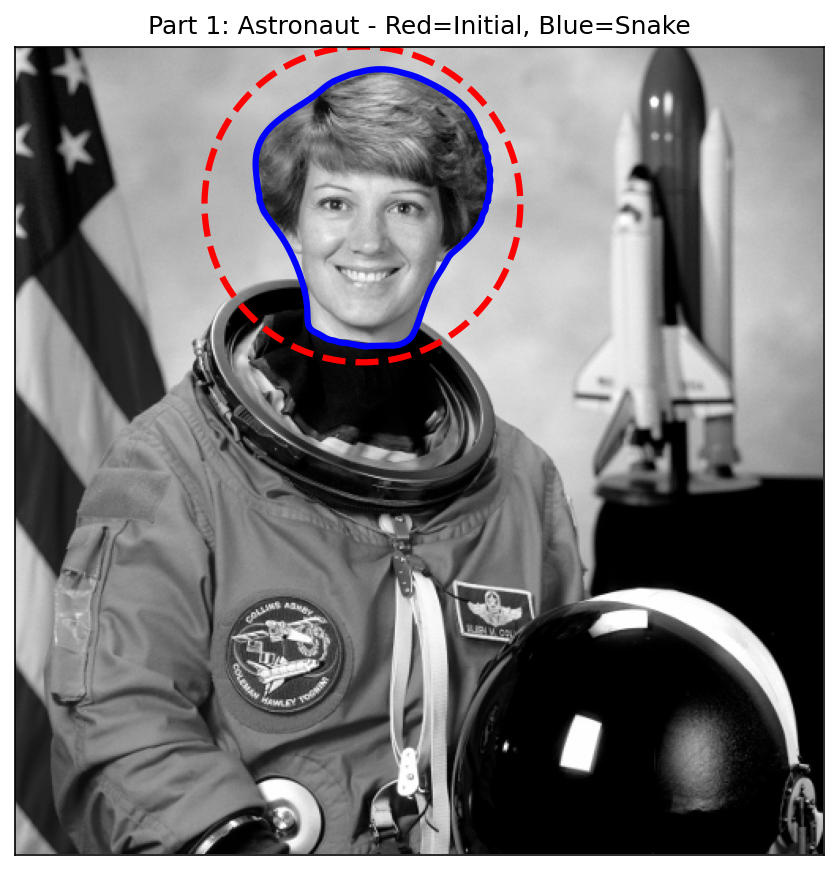
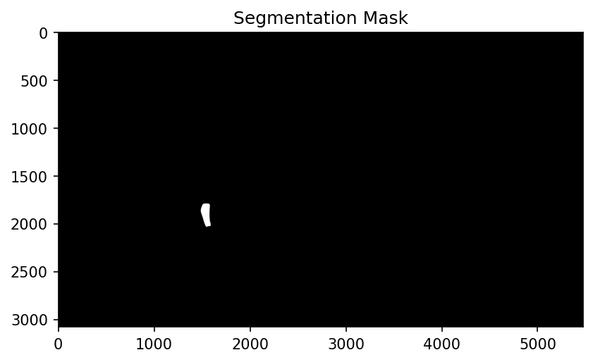

# Homework 05 — Snakes (Active Contours)

**CSE 40535 Computer Vision — Spring 2026**

## Part 1: Test Code

Reproduced the scikit-image active contour example on the astronaut image.
The snake is initialized as a circle (red dashed) and converges to the head boundary (blue).

## Part 2: Person Segmentation

Given a YOLO bounding box annotation for a person in a drone image, the pipeline:

1. Converts the YOLO annotation to pixel coordinates `(x1, y1, x2, y2)`
2. Builds a rectangular initial curve from the bounding box
3. Runs `active_contour` (snake) to find the person's boundaries
4. Fills a binary segmentation mask using `skimage.draw.polygon`
5. Blends the mask over the original image

**Bounding box** (red dashed) · **Snake boundaries** (blue) · **Segmentation mask** (jet overlay)

## Reflections on Active Contours

Active contours (snakes) are deformable curves that minimize an energy function combining
**internal energy** (smoothness/elasticity) and **external energy** (image gradient forces).
The three key parameters control their behavior:

- **alpha** (elasticity): resists stretching — higher values keep the curve compact
- **beta** (stiffness): resists bending — higher values produce smoother, more rigid curves
- **gamma** (step size): controls the speed of gradient-descent convergence

**Observations from this task:**

1. **Initialization matters**: Active contours are local optimizers — they require a
   starting curve already near the target boundary. The YOLO bounding box provided an
   excellent initialization; without it, finding the person in a 5472×3078 drone image
   would be infeasible.

2. **Background complexity**: The dense foliage creates many competing gradient edges.
   Gaussian pre-smoothing (σ=3) suppresses spurious edges but slightly blurs the person's
   true boundary.

3. **Scale sensitivity**: The person occupies only ~117×276 pixels in the full image.
   Parameters tuned for larger objects (like the astronaut's head) may cause the snake to
   shrink or drift slightly at this scale.

4. **No topology changes**: A classic snake cannot split or merge — it is limited to a
   single connected curve. Level-set methods or modern learned segmentation models (e.g.,
   SAM) overcome this limitation.

Overall, active contours are an elegant classical technique that works well when a
reasonable initialization is available from an upstream detector.
