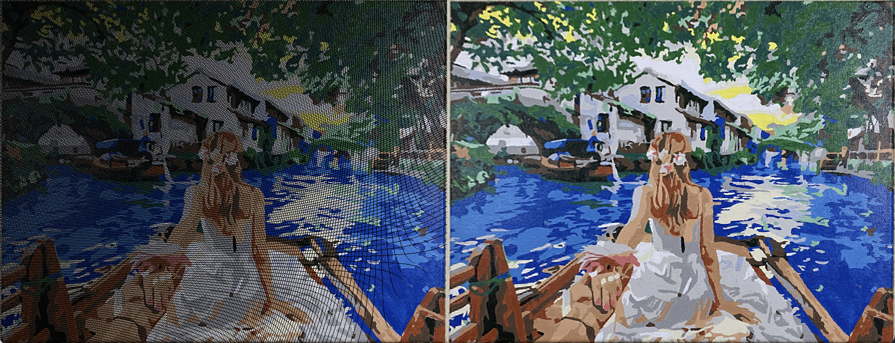
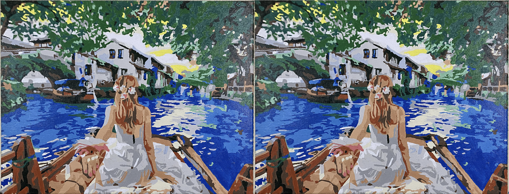

# Homework 06 — A Piece of Art

**CSE 40535 Computer Vision — Spring 2026**

The goal is to perform a projective transformation to de-warp a painting photographed
at an angle. Two warping methods are compared: forward warping (leaves holes) and
inverse warping (the correct solution).

---

## Step 1 — Forward Warping

`warpingInteractive.py` was run on `art.png`. Four corner points of the painting canvas
were selected clockwise from the top-left using the `roiPoly` GUI.

The skeleton code iterates over every **source** pixel, applies H to find its destination,
and copies the colour there. Because H maps to floating-point coordinates, many destination
pixels are never written — **black holes appear** throughout the output.



*Left: our forward-warp result (~55% filled — black holes visible).
Right: `cv2.warpPerspective` reference (no holes — shows what the correct answer looks like).*

---

## Step 2 — Inverse Warping (the solution)

**Three lines in `warpingInteractive.py` were modified:**

```python
# ── BEFORE (forward warp, skeleton code) ──────────────────────────────────
for y_source in range(0, rows):
    for x_source in range(0, cols):
        sourcePX = np.float32([[x_source], [y_source], [1]])
        # *** original line 1 — forward: H maps source → destination
        destPX = H_mat @ sourcePX
        x_dest = int(destPX[0,0]/destPX[2,0])
        y_dest = int(destPX[1,0]/destPX[2,0])
        if x_dest > 0 and y_dest > 0 and x_dest < cols and y_dest < rows:
            count += 1
            # *** original line 2
            I_transformed[y_dest, x_dest, :] = I[y_source, x_source, :]

# ── AFTER (inverse warp, solution) ────────────────────────────────────────
H_inv = np.linalg.inv(H_mat)          # pre-compute inverse  ← third line added

for y_dest in range(0, rows):         # iterate over DESTINATION pixels
    for x_dest in range(0, cols):
        destPX = np.float32([[x_dest], [y_dest], [1]])
        # *** modified line 1 — inverse: H⁻¹ maps destination → source
        sourcePX = H_inv @ destPX
        x_source = int(sourcePX[0,0]/sourcePX[2,0])
        y_source = int(sourcePX[1,0]/sourcePX[2,0])
        if x_source > 0 and y_source > 0 and x_source < cols and y_source < rows:
            count += 1
            # *** modified line 2 (same assignment, opposite direction)
            I_transformed[y_dest, x_dest, :] = I[y_source, x_source, :]
```

Inverse warping fills **100%** of destination pixels — no holes.



*Left: our inverse-warp result (100% filled — no holes).
Right: `cv2.warpPerspective` reference — the two panels are nearly identical.*

---

## Reflections

**Why does forward warping leave holes?**
H maps each source pixel to a floating-point destination coordinate. Rounding to the
nearest integer means multiple source pixels can land on the same destination pixel while
other destination pixels are never written to, leaving black holes (~45% of pixels
unfilled).

**Why does inverse warping fix this?**
Instead of asking "where does this source pixel go?", we ask "where did this destination
pixel come from?" For every output pixel we apply H⁻¹ to find its source coordinate.
Every destination pixel is guaranteed a colour as long as the source coordinate is
within bounds — so no holes can appear.

**`cv2.warpPerspective`** implements exactly this inverse-warp approach (plus bilinear
interpolation for sub-pixel accuracy), which is why its output matches our result.
