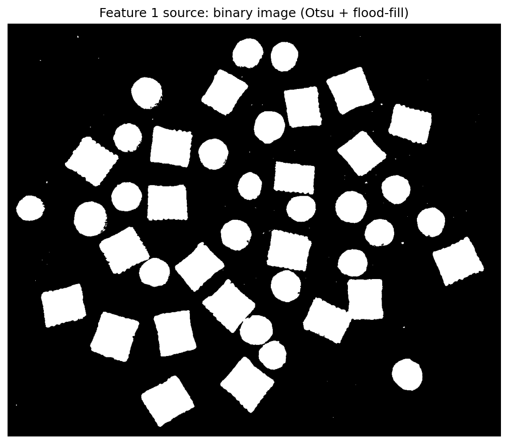
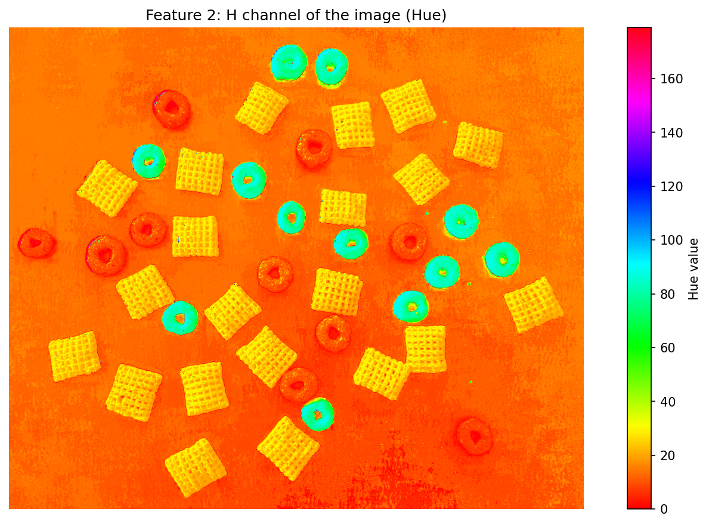
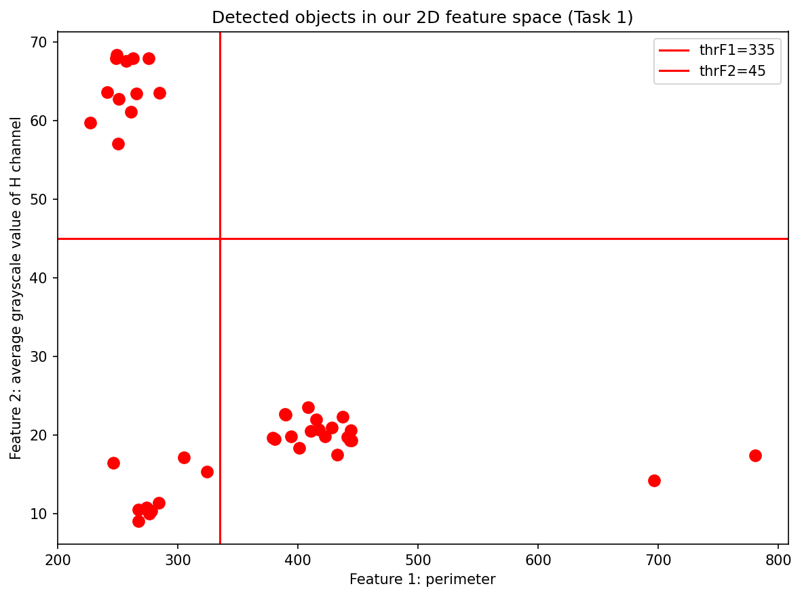
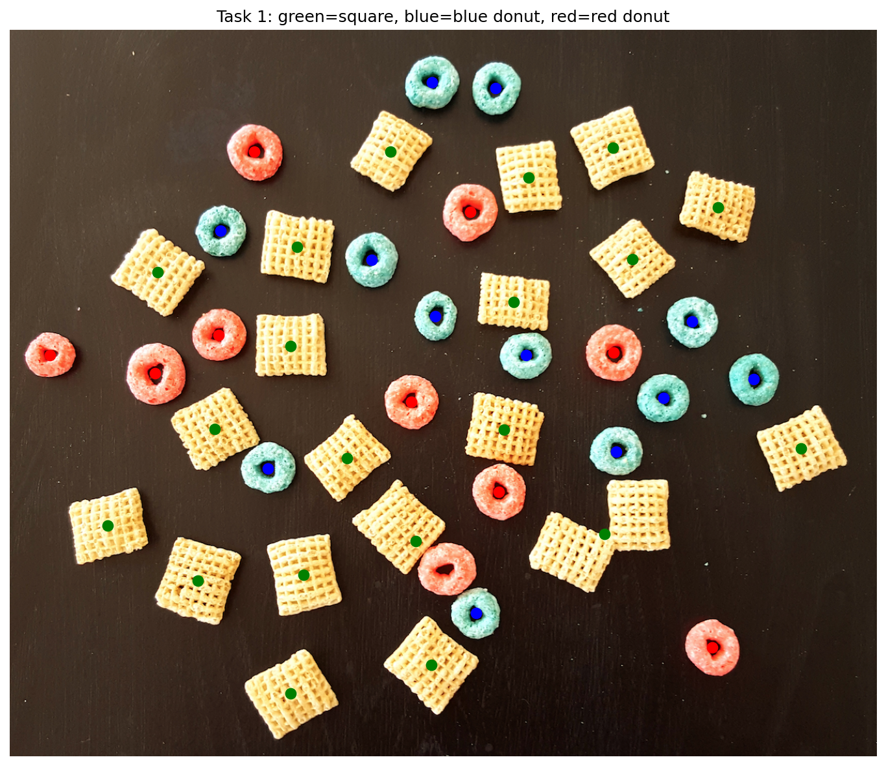
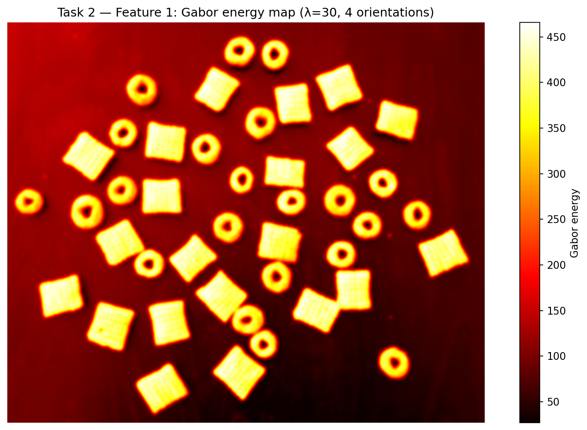
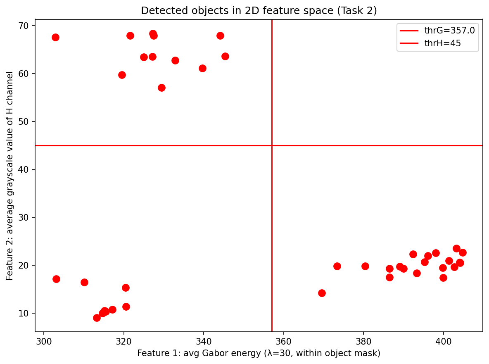
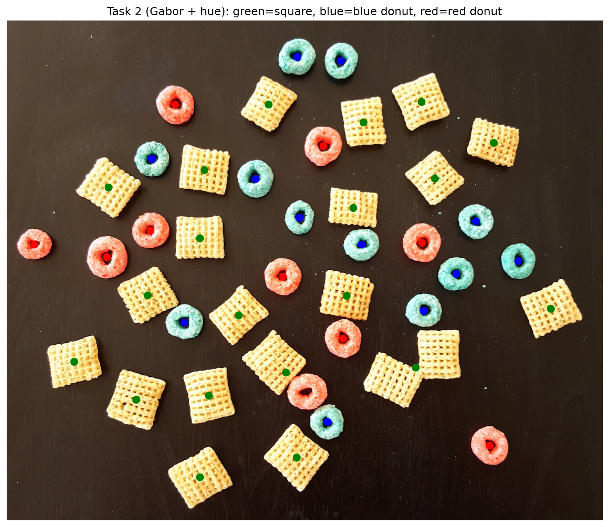

# Practical 02 — Simple Object Detection and Classification

**CSE 40535 Computer Vision — Spring 2026**

## Overview

Classify three types of breakfast cereal in an image:
- **21 Chex squares** (waffle-textured squares)
- **12 blue Fruit Loops** (smooth blue donuts)
- **10 red Fruit Loops** (smooth red/pink donuts)

**Pipeline:** Otsu thresholding → flood-fill holes → connected components → 2D feature classifier

---

## Task 1: Perimeter + Hue Features

### Feature 1 — Perimeter (geometry-based)

Extracted from the binary image produced by Otsu's method + flood-fill.
Squares have rough waffle edges → large perimeter (~375–450).
Donuts are smooth rings → small perimeter (~225–325).

### Feature 2 — Average Hue (color-based)

Mean value of the H channel (HSV) in each object's bounding box.
Blue donuts: high hue (~57–70). Red donuts and squares: low hue (~9–24).

### 2D Feature Space & Classification

Thresholds: `thrF1 = 335` (perimeter), `thrF2 = 45` (hue)

| Region | Condition | Class |
|---|---|---|
| perimeter > 335 | — | Square (green) |
| perimeter ≤ 335, hue > 45 | — | Blue donut (blue) |
| perimeter ≤ 335, hue ≤ 45 | — | Red donut (red) |

**Result: 20 squares, 12 blue donuts, 9 red donuts** *(41/43 detected; ~2 objects overlap in the image)*

---

## Task 2: Gabor Texture + Hue Features

Replace Feature 1 (perimeter) with the **average Gabor kernel energy** computed inside each object's segmentation mask.

**Rationale:** Perimeter is a good separator but depends on edge roughness from the binary image. Gabor texture is more principled: Chex squares have a strong grid/waffle texture (high Gabor response at λ=30), while smooth Fruit Loops donuts have low Gabor response. Feature 2 (hue) is kept to distinguish blue from red donuts.

**Gabor parameters:** ksize=21, σ=4.0, λ=30, γ=0.5, 4 orientations (0°, 45°, 90°, 135°)

### Gabor Energy Map

Bright regions = high texture energy = squares.

### 2D Feature Space & Classification

Thresholds: `thrG = 357` (Gabor energy), `thrH = 45` (hue)

**Result: 20 squares, 12 blue donuts, 9 red donuts** — identical counts to Task 1, confirming that Gabor texture is a valid replacement for the perimeter feature.

---

## Key Observations

- **Flood-fill** is critical: without it, each donut's hollow center becomes a separate region, corrupting the perimeter and area measurements.
- **Perimeter** (Task 1) and **Gabor energy** (Task 2) both cleanly separate squares from donuts, but through different mechanisms — shape complexity vs. spatial texture frequency.
- **Hue** is the necessary second feature in both tasks: it is the only way to distinguish blue from red donuts, as both are geometrically and texturally identical.
- 2 of 43 objects are missed (likely due to overlapping pieces or partial occlusion at the image boundary).
