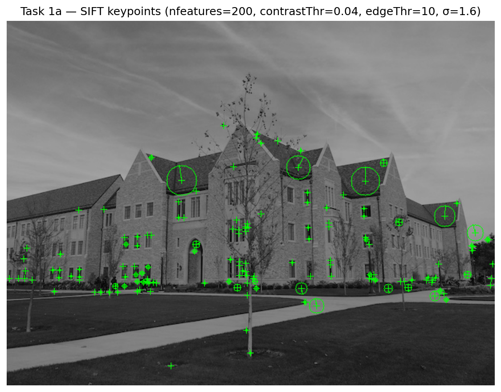
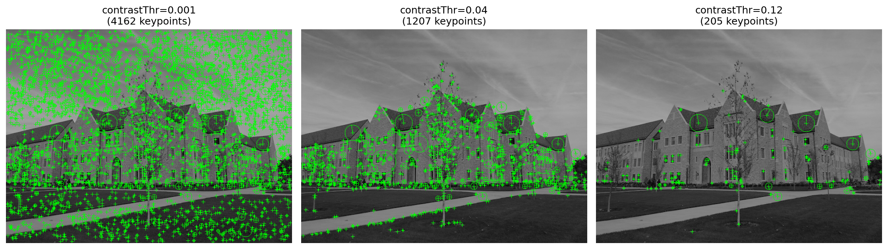
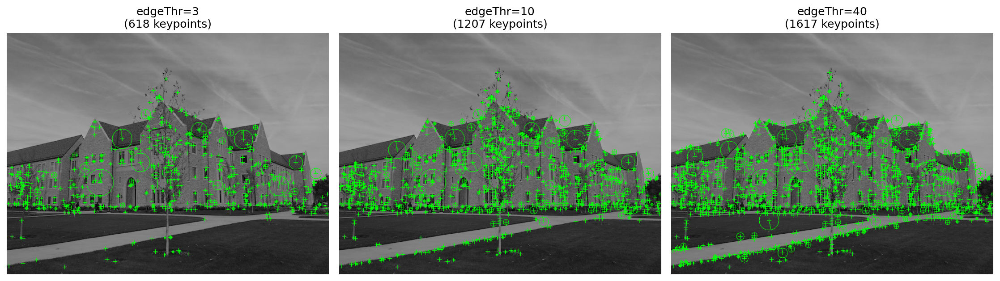
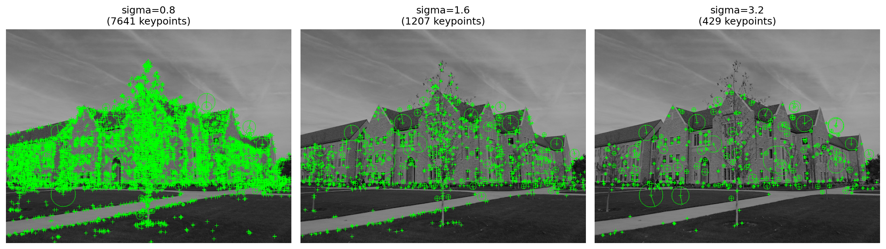
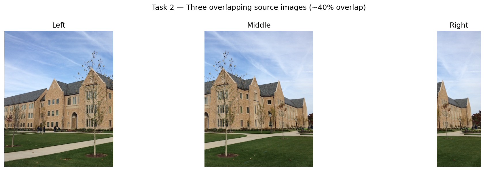
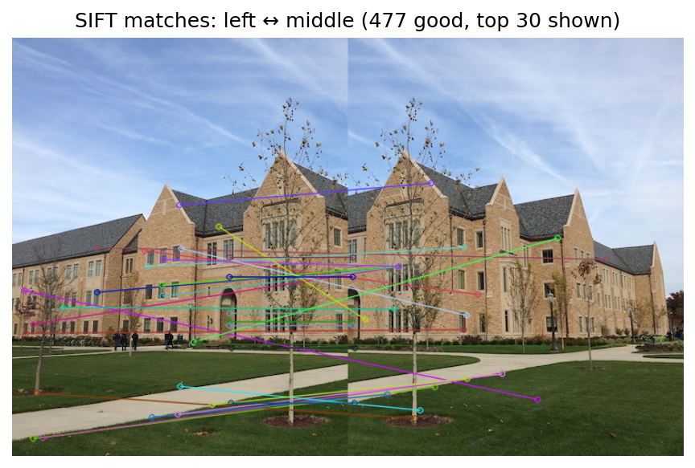
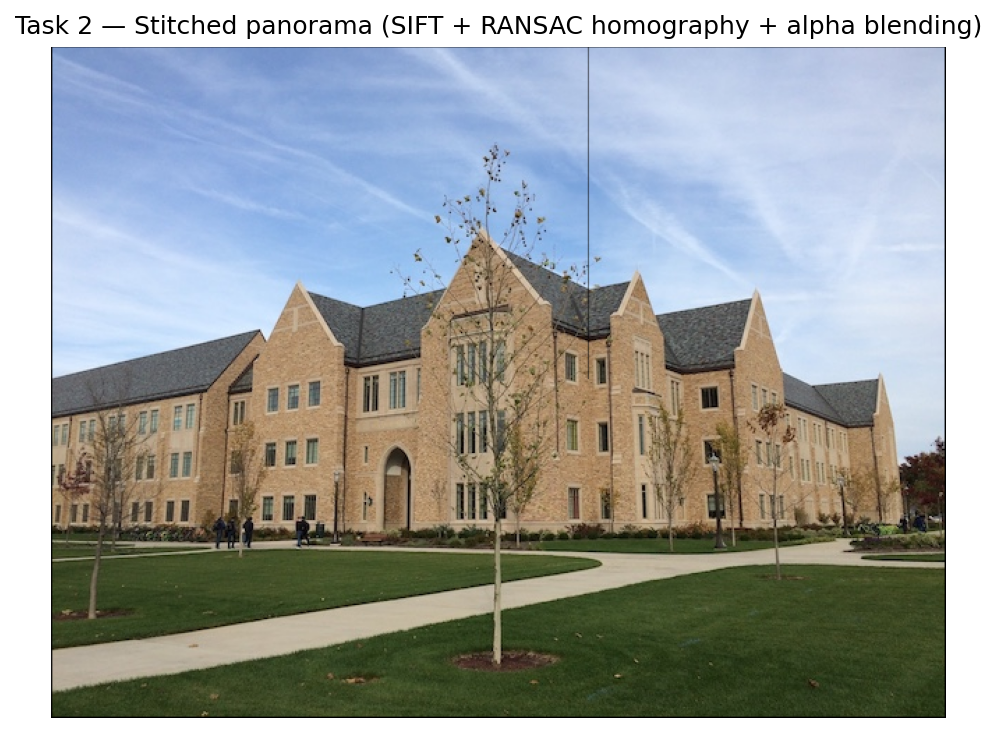

# Practical 03 — Image Stitching (at-home tasks)

**CSE 40535 Computer Vision — Spring 2026**

---

## Task 1a — SIFT keypoint detection

Run `cv2.SIFT_create()` on `nd2.jpg`. Each keypoint is drawn as a circle whose radius
encodes scale and whose line encodes dominant orientation. The descriptor is **128-dimensional**
(4×4 grid of cells × 8-bin gradient histograms).

---

## Task 1b — Parameter experiments

### `contrastThreshold` (lower → more keypoints, including weak/noisy ones)

### `edgeThreshold` (higher → keeps more edge-like keypoints)

### `sigma` (higher → more smoothing, fewer fine-scale keypoints)

| Parameter | What it controls |
|---|---|
| `nfeatures` | Hard cap on keypoints returned (0 = no limit) |
| `nOctaveLayers` | Gaussian pyramid layers per octave — more = finer scale resolution |
| `contrastThreshold` | Removes low-contrast candidates; **lower = more keypoints** |
| `edgeThreshold` | Removes edge-like candidates via principal-curvature ratio; **higher = keeps more** |
| `sigma` | Pre-blur applied before detection; higher = smoother, fewer fine details found |

---

## Task 2 — Panorama stitching

Three overlapping crops (~40% overlap) are extracted from `nd2.jpg` to simulate
three sequential photos taken while panning a camera.

### Source images

### SIFT matches between left and middle (477 good matches)

### Stitched panorama

**Pipeline:** SIFT detection → FLANN + Lowe ratio-test matching → RANSAC homography →
`cv2.warpPerspective` (inverse warp) → average blending

---

## Task 3 — Theory refresher

### a) SIFT

1. **Scale-space extrema** — DoG pyramid; local (x,y,σ) extrema are candidates
2. **Keypoint filtering** — reject low-contrast and edge-like candidates
3. **Orientation assignment** — dominant gradient direction makes descriptor rotation-invariant
4. **128-D descriptor** — 4×4 sub-regions × 8-bin histograms, L2-normalised

SIFT is invariant to **scale** (pyramid), **rotation** (orientation assignment),
and partially to **illumination** (normalisation) and **affine viewpoint** change.

### b) Geometric transformations & warping

A **homography** H maps a planar scene between two camera views (3×3 projective matrix).

- **Forward warp** — map each source pixel to the destination; leaves holes where mapped
  locations fall between integer pixels.
- **Inverse warp** (`cv2.warpPerspective`) — for each destination pixel, look up the
  source location via H⁻¹ and **interpolate** (bilinear). No holes; this is the standard
  approach used in panorama stitching.

RANSAC robustly estimates H from noisy SIFT correspondences by iteratively fitting to
random minimal subsets and keeping the hypothesis with the most inliers.
